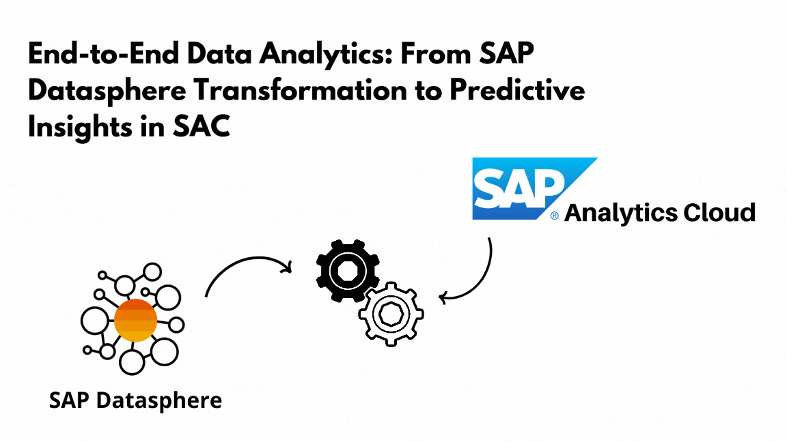
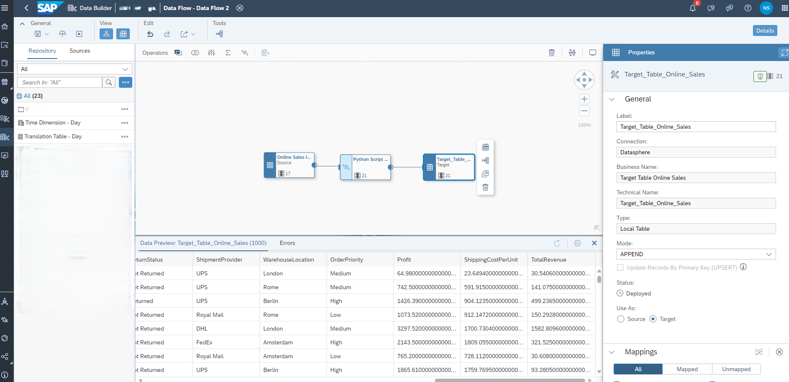
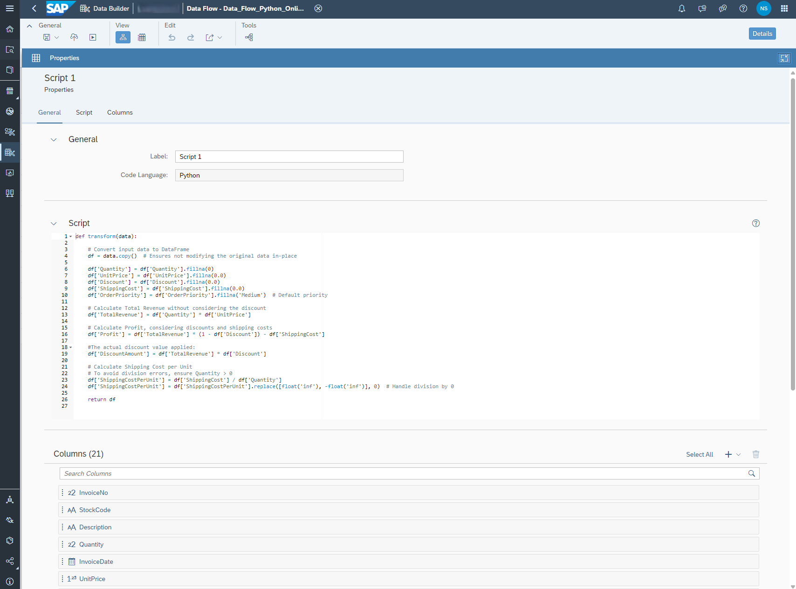
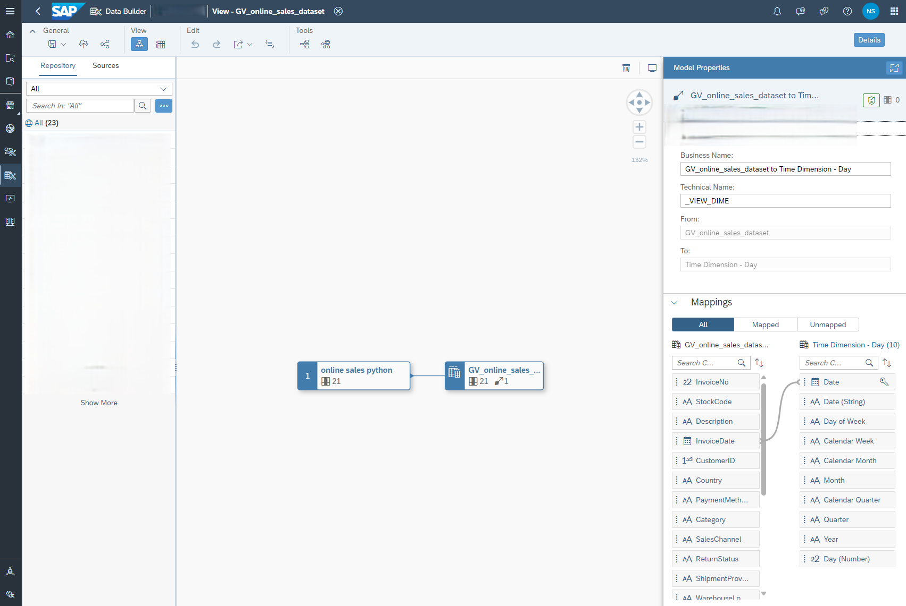
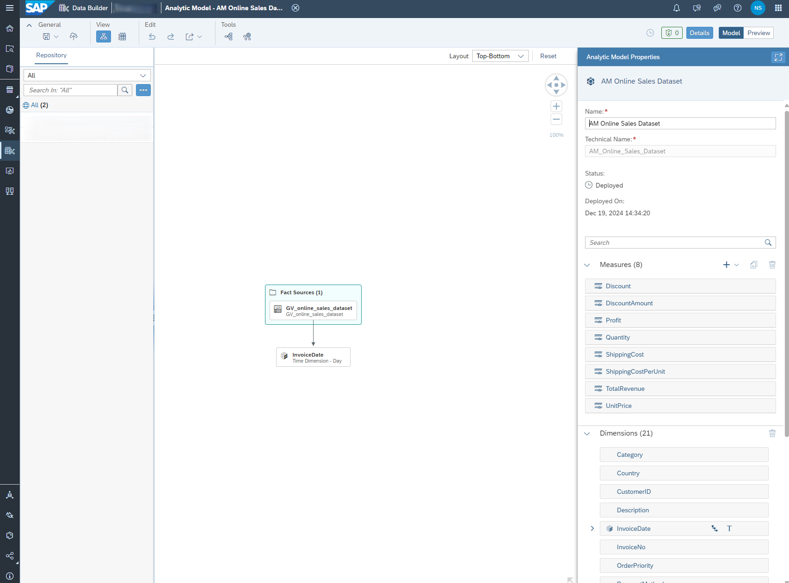
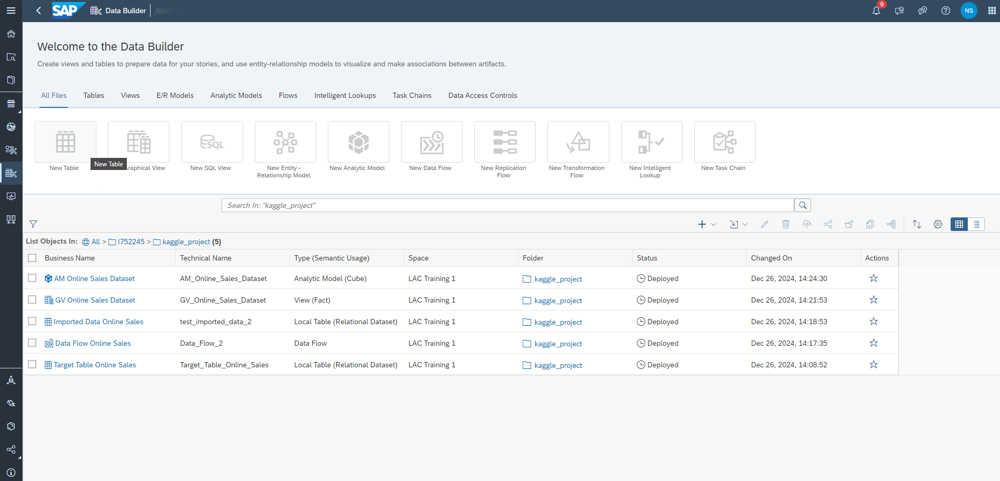

# End-to-End Data Analytics: From SAP Datasphere Transformation to Predictive Insights in SAC



# Project Overview

This project demonstrates a complete end-to-end data analytics workflow, integrating a dataset into SAP Datasphere, performing transformations using Python scripts, and preparing the data for consumption in SAP Analytics Cloud (SAC). By following this structured process, we ensure data consistency, enhance reporting capabilities, and enable predictive insights in SAC. Below is a detailed breakdown of each step undertaken.

## Step 1: Importing the Dataset

- Dataset: online_sales_dataset.csv
    - Represents online sales data with attributes like Quantity, UnitPrice, Discount, ShippingCost, OrderPriority, and more. (https://www.kaggle.com/datasets/yusufdelikkaya/online-sales-dataset/data) 
- Actions:
    1. Import the dataset into SAP Datasphere as a local table.
    2. Validate the table structure to match the dataset schema.
    3. Ensure data types are consistent with the expected values (e.g., numerical, categorical, or datetime).
    4. Handle any invalid or missing data during the import process.
- Outcome: A clean, validated table ready for transformation within SAP Datasphere.


## Step 2: Data Flow Creation

- Objective: Establish a Data Flow to enable seamless data transformations and create a transformed target table.

- Process:

1. Use the imported table as the source in the Data Flow.
2. Create the script in the data flow and add the additional columns.

### New Columns Added

- Profit: Represents the total earnings after discounts and shipping costs. This metric is crucial for understanding financial performance.
- TotalRevenue: Captures total sales revenue before any deductions, providing insight into gross earnings.
- DiscountAmount: Highlights the absolute value of discounts applied, offering transparency into pricing strategies.
- ShippingCostPerUnit: Facilitates per-unit cost analysis for logistics efficiency.

3. Create and deploy the target table.

- Outcome: A transformed table prepared for advanced calculations and analysis.



## Step 3: Python Script for Transformations



The following Python script was used to calculate the additional columns during the Data Flow execution:

```python
def transform(data):
    # Convert input data to DataFrame
    df = data.copy()  # Ensures not modifying the original data in-place

    # Handle missing values
    df['Quantity'] = df['Quantity'].fillna(0)
    df['UnitPrice'] = df['UnitPrice'].fillna(0.0)
    df['Discount'] = df['Discount'].fillna(0.0)
    df['ShippingCost'] = df['ShippingCost'].fillna(0.0)
    df['OrderPriority'] = df['OrderPriority'].fillna('Medium')  # Default priority

    # Calculate Total Revenue without considering the discount
    df['TotalRevenue'] = df['Quantity'] * df['UnitPrice']

    # Calculate Profit, considering discounts and shipping costs
    df['Profit'] = df['TotalRevenue'] * (1 - df['Discount']) - df['ShippingCost']

    # The actual discount value applied
    df['DiscountAmount'] = df['TotalRevenue'] * df['Discount']

    # Calculate Shipping Cost per Unit
    # To avoid division errors, ensure Quantity > 0
    df['ShippingCostPerUnit'] = df['ShippingCost'] / df['Quantity']
    df['ShippingCostPerUnit'] = df['ShippingCostPerUnit'].replace([float('inf'), -float('inf')], 0)  # Handle division by 0

    return df
```

### 3.1 Running the Data Flow

- Execute the Data Flow and monitor its status in the Data Flow Monitor.
- Ensure all mappings and column names are correct to avoid errors.

## Step 4: Creating a Graphical View



- Objective: Build a Graphical View (Fact Table) to aggregate measures and dimensions for analytical reporting.
- Configuration:
    - Measures: Include numerical columns like Profit, TotalRevenue, and DiscountAmount.
    - Dimensions: Incorporate categorical fields such as OrderPriority, SalesChannel, and Country.
    - Associate a Time Dimension Table to support hierarchical time-based reporting without additional table creation.
- Outcome: A robust view optimized for performance and ready for analytical modeling.

## Step 5: Creating the Analytical Model



- Objective: Define an Analytical Model to expose the transformed data for SAC.
- Process:
    1. Use the Graphical View as the primary data source.
    2. Configure measures and dimensions as required by the reporting needs.
    3. Enable the model for data preview to validate the transformations.
- Outcome: An Analytical Model configured for seamless integration with SAC

## 6. Overview Datasphere

1. Import the Dataset
2. Create the Data Flow and Target table
3. Python script 
4. Create a Graphical View
5. Create an Analytical Model and expose for consumption



## To Be Continued: Steps in SAC (Work in Progress)

- The next steps involve:
- Importing the Analytical Model into SAP Analytics Cloud (SAC).
- Building dashboards and reports using the prepared data. (including predcitive analysis)

