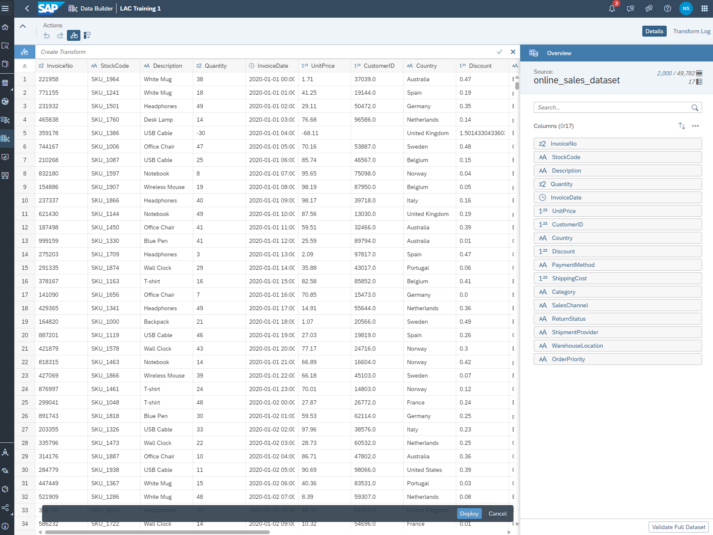

# SAP-Datasphere-and-SAP-SAC-Project

# Project Overview

This project demonstrates how to integrate a dataset into SAP Datasphere, perform data transformations using Python scripts, and prepare the data for consumption in SAP Analytics Cloud (SAC). Below are the steps and processes followed in this project.

## Step 1: Importing the Dataset

- Import the provided dataset (online_sales_dataset.csv) into SAP Datasphere.
- Create a local table (relational dataset) based on the imported file.
- Note: Ensure the table structure matches the dataset schema. Make any necessary transformations in the dataset, ensure the data types are correctly matched and that the full dataset is valid

## Step 2: Data Flow Creation

- Create a Data Flow in Datasphere to perform the required data transformations.
- Add the imported table as the source of the Data Flow.
- Duplicate the source table to create a second local table and deploy the new table.

## Step 3: Adding Additional Columns for Calculations

To enable advanced reporting in SAC, additional columns were added to both tables:
- Profit
- TotalRevenue
- DiscountAmount
- ShippingCostPerUnit

### 3.1 Python Script for Transformations

The following Python script was used in the Data Flow to calculate the additional columns:

def transform(data):
    # Convert input data to DataFrame
    df = data.copy()  # Ensures not modifying the original data in-place

    # Handle missing values
    df['Quantity'] = df['Quantity'].fillna(0)
    df['UnitPrice'] = df['UnitPrice'].fillna(0.0)
    df['Discount'] = df['Discount'].fillna(0.0)
    df['ShippingCost'] = df['ShippingCost'].fillna(0.0)
    df['OrderPriority'] = df['OrderPriority'].fillna('Medium')  # Default priority

    # Calculate Total Revenue without considering the discount
    df['TotalRevenue'] = df['Quantity'] * df['UnitPrice']

    # Calculate Profit, considering discounts and shipping costs
    df['Profit'] = df['TotalRevenue'] * (1 - df['Discount']) - df['ShippingCost']

    # The actual discount value applied
    df['DiscountAmount'] = df['TotalRevenue'] * df['Discount']

    # Calculate Shipping Cost per Unit
    # To avoid division errors, ensure Quantity > 0
    df['ShippingCostPerUnit'] = df['ShippingCost'] / df['Quantity']
    df['ShippingCostPerUnit'] = df['ShippingCostPerUnit'].replace([float('inf'), -float('inf')], 0)  # Handle division by 0

    return df

### 3.2 Running the Data Flow

- Execute the Data Flow.
- Monitor the execution status in the Data Flow Monitor to ensure it completes successfully.
- Handle possible errors by checking columns mapping or columns names

## Step 4: Creating a Graphical View

- Create a Graphical View (Fact) based on the transformed dataset.
- Define the following:
    - Measures: Include numerical columns such as Profit, TotalRevenue, DiscountAmount, etc.
    - Dimensions: Include categorical columns such as OrderPriority, SalesChannel, Country, etc.
    - Associate a Time Table Dimension to enable hierarchical time-based reporting.

## Step 5: Creating the Analytical Model

- Create an Analytical Model using the Graphical View (Fact table) as the source.
- Configure the model to expose the data for consumption.

## To Be Continued: Steps in SAC (Work in Progress)

- The next steps involve:
- Importing the Analytical Model into SAP Analytics Cloud (SAC).
- Building dashboards and reports using the prepared data. (including predcitive analysis)

