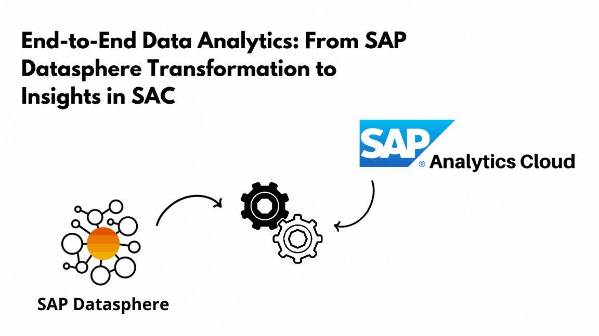
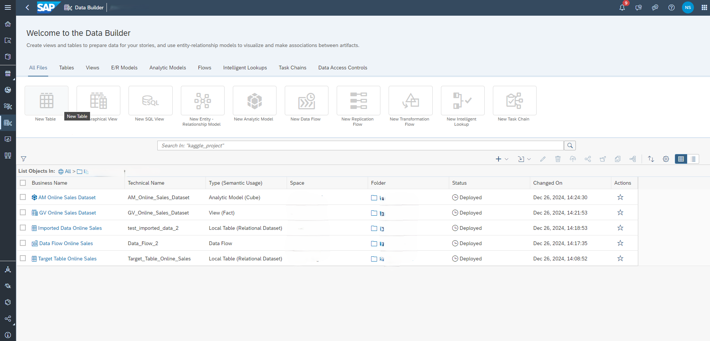
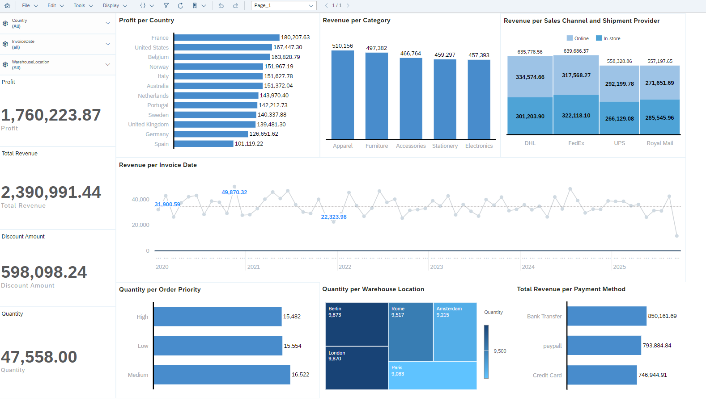

# End-to-End Data Analytics: From SAP Datasphere Transformation to Predictive Insights in SAC



# Project Overview

This project demonstrates a complete end-to-end data analytics workflow, integrating a dataset into SAP Datasphere, performing transformations using Python scripts, and preparing the data for consumption in SAP Analytics Cloud (SAC). By following this structured process, we ensure data consistency, enhance reporting capabilities, and enable predictive insights in SAC. Below is a detailed breakdown of each step undertaken.

## Step 1: Importing the Dataset

- Dataset: online_sales_dataset.csv
    - Represents online sales data with attributes like Quantity, UnitPrice, Discount, ShippingCost, OrderPriority, and more. (https://www.kaggle.com/datasets/yusufdelikkaya/online-sales-dataset/data) 
- Actions:
    1. Import the dataset into SAP Datasphere as a local table.
    2. Validate the table structure to match the dataset schema.
    3. Ensure data types are consistent with the expected values (e.g., numerical, categorical, or datetime).
    4. Handle any invalid or missing data during the import process.
- Outcome: A clean, validated table ready for transformation within SAP Datasphere.


## Step 2: Data Flow Creation

- Objective: Establish a Data Flow to enable seamless data transformations and create a transformed target table.

- Process:

1. Use the imported table as the source in the Data Flow.
2. Create the script in the data flow and add the additional columns.

### New Columns Added

- Profit: Represents the total earnings after discounts and shipping costs. This metric is crucial for understanding financial performance.
- TotalRevenue: Captures total sales revenue before any deductions, providing insight into gross earnings.
- DiscountAmount: Highlights the absolute value of discounts applied, offering transparency into pricing strategies.
- ShippingCostPerUnit: Facilitates per-unit cost analysis for logistics efficiency.

3. Create and deploy the target table.

- Outcome: A transformed table prepared for advanced calculations and analysis.


## Step 3: Python Script for Transformations


The following Python script was used to calculate the additional columns during the Data Flow execution:

```python
def transform(data):
    # Convert input data to DataFrame
    df = data.copy()  # Ensures not modifying the original data in-place

    # Handle missing values
    df['Quantity'] = df['Quantity'].fillna(0)
    df['UnitPrice'] = df['UnitPrice'].fillna(0.0)
    df['Discount'] = df['Discount'].fillna(0.0)
    df['ShippingCost'] = df['ShippingCost'].fillna(0.0)
    df['OrderPriority'] = df['OrderPriority'].fillna('Medium')  # Default priority

    # Calculate Total Revenue without considering the discount
    df['TotalRevenue'] = df['Quantity'] * df['UnitPrice']

    # Calculate Profit, considering discounts and shipping costs
    df['Profit'] = df['TotalRevenue'] * (1 - df['Discount']) - df['ShippingCost']

    # The actual discount value applied
    df['DiscountAmount'] = df['TotalRevenue'] * df['Discount']

    # Calculate Shipping Cost per Unit
    # To avoid division errors, ensure Quantity > 0
    df['ShippingCostPerUnit'] = df['ShippingCost'] / df['Quantity']
    df['ShippingCostPerUnit'] = df['ShippingCostPerUnit'].replace([float('inf'), -float('inf')], 0)  # Handle division by 0

    return df
```

### 3.1 Running the Data Flow

- Execute the Data Flow and monitor its status in the Data Flow Monitor.
- Ensure all mappings and column names are correct to avoid errors.

## Step 4: Creating a Graphical View


- Objective: Build a Graphical View (Fact Table) to aggregate measures and dimensions for analytical reporting.
- Configuration:
    - Measures: Include numerical columns like Profit, TotalRevenue, and DiscountAmount.
    - Dimensions: Incorporate categorical fields such as OrderPriority, SalesChannel, and Country.
    - Associate a Time Dimension Table to support hierarchical time-based reporting without additional table creation.
- Outcome: A robust view optimized for performance and ready for analytical modeling.

## Step 5: Creating the Analytical Model


- Objective: Define an Analytical Model to expose the transformed data for SAC.
- Process:
    1. Use the Graphical View as the primary data source.
    2. Configure measures and dimensions as required by the reporting needs.
    3. Enable the model for data preview to validate the transformations.
- Outcome: An Analytical Model configured for seamless integration with SAC

## 6. Overview Datasphere

1. Import the Dataset
2. Create the Data Flow and Target table
3. Python script 
4. Create a Graphical View
5. Create an Analytical Model and expose for consumption



## Step 7: Importing the Analytical Model into SAP Analytics Cloud (SAC)

- Objective: Leverage the prepared Analytical Model from SAP Datasphere in SAC to create interactive dashboards and visualizations.
- Process:
    1. Connect SAC to Datasphere: Create or use an existing connection to the Datasphere Tenant. Follow SAP Help Documentation to establish the connection

## Step 8: Building the Report and Dashboard in SAC

The SAP Analytics Cloud (SAC) dashboard is designed to provide comprehensive insights into sales performance, operational efficiency, and customer behavior. The following features have been implemented to ensure a data-driven decision-making process:



### Key Features in the Report:

1. Profit Analysis by Country:

    - Visualization: A bar chart showcasing profits by country.
    - Purpose: Identify top-performing regions (e.g., France, the US, Belgium) to guide resource allocation and strategy development.

2. Revenue by Category:

    - Visualization: Vertical bar charts splitting revenue across product categories like Apparel, Furniture, and Accessories.
    - Purpose: Understand category-level performance to optimize inventory and marketing efforts.

3. Revenue per Sales and Shipment Provider:

    - Visualization: A combination of bar and column charts breaking down revenue by:
        - Sales Channel: Online vs. in-store.
        - Shipment Providers: DHL, FedEx, UPS, and Royal Mail.
    - Purpose: Evaluate the efficiency and contribution of sales and logistics channels.

4. Time-Based Trends:

    - Visualization: Line charts showing revenue trends over time.
    - Feature: Includes a reference line indicating the average revenue value across the entire timeline.
    - Purpose: 
        - Observe seasonality, identify growth patterns, and forecast future performance.
        - Identify periods where revenue exceeds or falls below the average, enabling quick identification of anomalies or high-performing periods.

5. Operational Insights:

    - Visualization: Key Performance Indicators (KPIs) for:
        - Total Profit.
        - Total Revenue.
        - Discount Amount.
        - Quantity sold.
    - Additional Insight: Priority-based visualizations to analyze order handling and efficiency.
    - Purpose: Offer a quick overview of critical business metrics for operational decision-making.

6. Quantity per Warehouse Location:

    - Visualization: A tree map to highlight the quantity of products stored or shipped from different warehouse locations.
    - Purpose: Optimize warehouse management by identifying stock levels and potential bottlenecks.

7. Payment Method Analysis:

    - Visualization: A pie or bar chart breaking down revenue by payment methods (e.g., Bank Transfer, PayPal, Credit Card).
    - Purpose: Analyze customer payment preferences to enhance checkout processes and payment options.

## End-to-End Integration

This project demonstrates the seamless integration between SAP Datasphere and SAP Analytics Cloud:

1. SAP Datasphere:

    - Handles data ingestion, transformation, and modeling.
    - Python scripts allow for advanced transformations like Profit and DiscountAmount calculations.

2. SAP Analytics Cloud (SAC):

    - Provides a platform for consuming the transformed data and presenting it through interactive dashboards.

## Filters for the Report:

- Available Filters:
    - Country: Narrow down the analysis to specific regions to focus on local performance.
    - Invoice Date: Filter the data by specific timeframes to identify trends or seasonality.
    - Warehouse Location: Focus on performance metrics by individual operational centers.

- Functionality:
    - These filters apply to the entire report, dynamically updating all visualizations and KPIs, including charts for Profit Analysis by Country, Revenue by Category, Quantity per Warehouse Location, and Time-Based Trends.
    - Users can easily adjust filters to explore data across multiple dimensions or combinations, ensuring maximum flexibility for targeted analysis.

- Purpose:
    - Enhance user interactivity by enabling custom views tailored to specific business questions.
    - Improve decision-making by allowing granular exploration of data subsets.

## Value of the Dashboard

This dashboard bridges the gap between raw data and actionable insights. Key advantages include:

1. Profitability Analysis: Recognize top-performing regions and categories to focus resources effectively.
2. Customer Insights: Analyze payment methods and sales channels to improve customer satisfaction and sales strategies.
3. Operational Efficiency: Use KPIs and priority-based insights to enhance operational decision-making.
4. Strategic Planning: Leverage time-based trends for forecasting and aligning business goals with observed patterns.